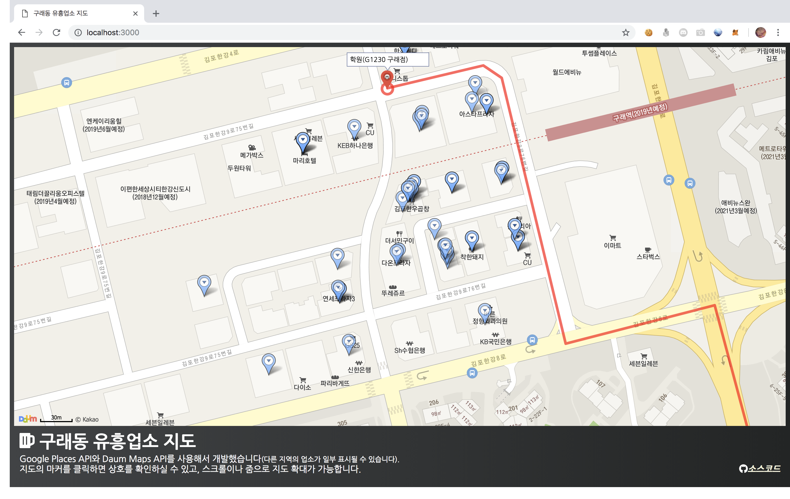

# 구래동 유흥업소 지도



1. Set `api_key`(for [Google Places API](https://developers.google.com/places/web-service/intro)), `keywords` in `config.json`.
2. Run `search.py` with Python3.
3. Edit following line of `index.html` with your [Daum Maps API](http://apis.map.daum.net/web/guide/) `APP_KEY`. You may need to make a new Kakao App and register web domains that you will use for testing & deploying.

```html
<script type="text/javascript" src="//dapi.kakao.com/v2/maps/sdk.js?appkey=APP_KEY&libraries=services"></script>
```

4. Run `python -m SimpleHTTPServer 3000` and open your browser, go to `http://localhost:3000` and tada! If this doesn't work, you may need to register the domain `http://localhost:3000` in your Kakao App that you used the `APP_KEY` with.

Please don't include your personal data(like your `api_key`/`APP_KEY`) or the **data of any business** when you contribute.
